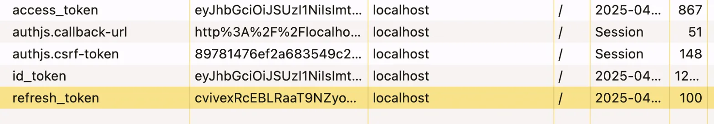

# Next.js Authentication 與 Authorization

- https://nextjs.org/docs/pages/building-your-application/authentication#authorization
- https://www.youtube.com/watch?v=bwRj1O30JWg
- https://github.com/bibibobobi/next-auth-demo

## 基本概念

### Authentication 與 Authorization 區別

- **Authentication（身份驗證）**：確認用戶是誰（「你是誰？」）
- **Authorization（授權）**：確認用戶有什麼權限（「你能做什麼？」）

### 保護重點

- Next.js 分為 client-side 和 server-side
- Server-side protection 最為重要，因為這裡與 database 溝通
- Client-side 也需要 authentication 來顯示 user information（avatar、email 等）

### Authentication 基礎

- 基於 cookies 和 tokens (JWT)
- 登錄狀態本質是擁有有效的 access token
- 推薦使用第三方解決方案（如 Kinde）而非 Do It Yourself

  - 安全性考量

    專業安全知識：身份驗證涉及複雜的安全問題，第三方解決方案通常由安全專家團隊開發，能夠應對最新的安全威脅
    定期安全更新：專業供應商會持續監控安全漏洞並提供更新，避免過時的安全實踐
    標準合規性：遵循 OAuth 2.0、OIDC 等行業標準協議，確保安全性符合最佳實踐

  - 節省開發資源

    減少開發時間：無需從零開始實現複雜的身份驗證系統
    降低維護成本：不必持續更新和維護自己的身份驗證代碼
    專注核心業務：團隊可以將時間投入在應用的核心功能開發上

  - 功能完整性

    多種身份驗證方式：內建支援多種登入方式（社交媒體、電子郵件、手機號碼等）
    現成的用戶管理：提供用戶註冊、密碼重置、帳戶鎖定等功能
    多平台支援：同時適用於網頁、移動應用等多種平台

  - 可擴展性

    處理高流量：設計用於支援大量用戶請求
    按需擴展：隨著用戶增長輕鬆擴展服務
    全球分佈：通常提供全球 CDN，確保全球範圍內的快速響應

  - 長期風險管理

    避免單點故障：專業服務有備份和容錯機制
    責任轉移：安全問題部分責任轉移給第三方供應商
    降低技術債：減少因自行實現而累積的技術債

#### Authentication Tokens 與 Cookies


這張圖顯示的是瀏覽器 cookies 列表，展示了身份驗證過程中使用的各種 tokens 和資訊。這些是實現身份驗證系統的核心元素：

1. **access_token**：

   - 是一個 JWT (JSON Web Token)，包含用戶身份和權限
   - 短期有效（通常幾小時至一天）
   - 用於向服務器證明用戶已登入，允許訪問受保護的資源

2. **refresh_token**：

   - 用於獲取新的 access token，當 access token 過期時使用
   - 通常有效期更長（數天至數週）
   - 重要的安全元素，保存在 cookie 中

3. **id_token**：

   - 包含用戶身份信息的 JWT
   - 主要用於客戶端了解用戶身份，不應用於授權
   - 持有用戶的個人資料訊息

4. **authjs.callback-url**：

   - 用戶成功認證後的重定向 URL

5. **authjs.csrf-token**：
   - 防止跨站請求偽造 (CSRF) 攻擊的安全令牌
   - 每個會話唯一，用於驗證請求的真實性

這些 cookies 共同支持了完整的身份驗證流程，讓系統能夠：

- 保持用戶登入狀態
- 安全地更新存取權限
- 防止常見的安全漏洞
- 提供無縫的用戶體驗

--

### 需要保護的元素

- Server Components
- Server Actions
- Route Handlers

## Routes Protection 方法

### 1. Page Component Protection

```javascript
const isAuth = await isAuthenticated();
if (!isAuth) {
  redirect("/api/auth/login");
}
```

### 2. Middleware Protection（推薦）

```javascript
// middleware.js
export function middleware(request) {
  return withAuth(request);
}

export const config = {
  matcher: ["/dashboard", "/expense", "/admin"],
};
```

### 3. Protection 位置選擇

- 避免在 Layout component 中進行檢查，因 navigation 時不會重新 render
- Middleware 優點：集中管理 redirect rules，保持頁面 static rendering
- Page component 檢查：需在每個受保護頁面重複代碼

## 常見 Pitfalls 與解決方案

### 1. Server Actions Security

- Server actions 可能在未受保護 routes 被調用
- 解決：在 action 內部進行 authentication check

```javascript
async function addExpense(input) {
  // 先進行身份驗證檢查
  const isAuth = await isAuthenticated();
  if (!isAuth) {
    redirect("/api/auth/login");
  }

  // 繼續處理數據...
}
```

### 2. Static & Dynamic Rendering 問題

- Server components 中的 authentication 功能會使頁面變為 dynamic rendering
- 解決：將需要 user information 的 components 轉為 client components

```javascript
// client side 元件中的用戶資訊
"use client";

import { useKindeBrowserClient } from "@kinde-oss/kinde-auth-nextjs";

export default function Header() {
  const { user } = useKindeBrowserClient();

  return (
    <header>
      {user ? (
        <>
          
          <span>{user.email}</span>
        </>
      ) : (
        "Not logged in"
      )}
    </header>
  );
}
```

### 3. Authorization Check 遺漏

- Authentication 只確認用戶已登錄，不確保有權編輯特定 resource
- 解決：編輯/刪除操作必須檢查 resource ownership

```javascript
// 編輯操作中的授權檢查
async function editExpense(id, data) {
  // 身份驗證檢查
  const isAuth = await isAuthenticated();
  if (!isAuth) redirect("/api/auth/login");

  const user = await getUser();

  // 授權檢查 - 確認用戶擁有此支出
  const expense = await db.expense.findUnique({ where: { id } });
  if (expense.userId !== user.id) {
    throw new Error("Not authorized");
  }

  // 繼續編輯操作...
}
```

### 4. Roles & Permissions 管理

- 使用第三方解決方案（如 Kinde）管理 roles 和 permissions
- 檢查用戶是否具有特定 role 或 permission

```javascript
// 基於角色的授權
const roles = await getRoles();
if (roles[0]?.key !== "admin_user") {
  throw new Error("Admin access required");
}
```

## Best Practices

### Data Access Layer (DAL)

- 將所有 database access 集中在專用 files 中
- 在 Data Access Layer 添加 authentication 和 authorization checks
- 確保無論在哪裡使用，都執行 security checks

```javascript
// data/expenses.js
export async function getExpenses() {
  // 身份驗證檢查
  const isAuth = await isAuthenticated();
  if (!isAuth) redirect("/api/auth/login");

  const user = await getUser();

  // 查詢數據
  return db.expense.findMany({
    where: { userId: user.id },
  });
}
```

---

# 本範例如何實現身份驗證和從 db 獲取特定用戶資料

## 1. 使用 Middleware 保護路由

Middleware 在請求到達頁面前執行，可以檢查身份驗證狀態：

```typescript
// middleware.ts
import { NextRequest } from "next/server";
import { withAuth } from "@kinde-oss/kinde-auth-nextjs/middleware";

// 此函數會在請求進入時執行
export function middleware(request: NextRequest) {
  return withAuth(request);
}

// 定義哪些路由需要被 middleware 保護
export const config = {
  matcher: ["/dashboard", "/expense", "/admin"],
};
```

## 2. Server Actions 中獲取用戶特定數據

在 server actions 中，我們先驗證用戶身份，然後獲取該用戶的特定數據：

```typescript
// app/lib/action.ts
export async function getUserExpensesAction(): Promise<Expense[]> {
  const user = await authenticate();

  try {
    // 查詢條件包含 userId 篩選，確保只返回當前用戶的數據
    return await prisma.expense.findMany({
      where: {
        userId: user.id,
      },
      orderBy: {
        createdAt: "desc",
      },
    });
  } catch (error) {
    console.error("Error fetching expenses:", error);
    throw new Error("Failed to fetch expenses");
  }
}

// 身份驗證輔助函數
async function authenticate() {
  const { getUser, isAuthenticated } = getKindeServerSession();
  const isAuth = await isAuthenticated();

  if (!isAuth) {
    redirect("/api/auth/login");
  }

  const user = await getUser();

  if (!user?.id) {
    throw new Error("User not found");
  }

  return user;
}
```

## 3. 在 Header 中顯示用戶信息

在客戶端 Header 中，使用 Kinde 客戶端 Hook 獲取和顯示用戶訊息：

```typescript
// app/components/header.tsx
"use client";

import { useKindeBrowserClient } from "@kinde-oss/kinde-auth-nextjs/client";

export default function Header() {
  const { user, isAuthenticated, isLoading } = useKindeBrowserClient();

  return (
    <header className="flex items-center justify-between p-4 bg-green-100">
      <div className="flex items-center gap-2">
        {isLoading ? (
          <div className="w-8 h-8 rounded-full bg-gray-300 animate-pulse"></div>
        ) : user?.picture ? (
          <Image
            src={user.picture}
            alt={user.given_name || "User"}
            className="rounded-full"
            width={32}
            height={32}
          />
        ) : (
          <div className="w-8 h-8 rounded-full bg-gray-300"></div>
        )}
        <span className="font-medium">
          {isLoading ? "Loading..." : user?.email || "Expenses App"}
        </span>
      </div>

      {/* 根據身份驗證狀態顯示不同的導航連結 */}
    </header>
  );
}
```

## 4. 建立與用戶關聯的數據

建立新數據時，將其關聯到當前用戶：

```typescript
// app/lib/action.ts - createExpenseAction 函數
export async function createExpenseAction(formData: FormData): Promise<void> {
  const user = await authenticate();

  const amount = formData.get("amount")?.toString();
  const description = formData.get("description")?.toString();

  if (!amount || !description) {
    throw new Error("Amount and description are required");
  }

  try {
    await prisma.expense.create({
      data: {
        description,
        amount: parseFloat(amount),
        userId: user.id, // 將數據與當前用戶關聯
      },
    });

    revalidatePath("/dashboard");
    revalidatePath("/expense");
  } catch (error) {
    console.error("Error creating expense:", error);
    throw new Error(
      error instanceof Error ? error.message : "An unknown error occurred"
    );
  }
}
```

## 5. 修改數據前的授權檢查

在允許用戶刪除數據前，驗證該數據是否屬於該用戶：

```typescript
// app/lib/action.ts - deleteExpenseAction 函數
export async function deleteExpenseAction(formData: FormData): Promise<void> {
  const user = await authenticate();
  const expenseId = formData.get("id")?.toString();

  if (!expenseId) {
    throw new Error("No expense ID provided");
  }

  try {
    // 授權檢查 - 確認支出記錄屬於該用戶
    const expense = await prisma.expense.findUnique({
      where: { id: expenseId },
    });

    if (!expense) {
      throw new Error("Expense not found");
    }

    // 檢查資源所有權
    if (expense.userId !== user.id) {
      // 檢查用戶是否為管理員（備用授權路徑）
      const isAdmin = await isUserAdmin();

      if (!isAdmin) {
        throw new Error("Not authorized to delete this expense");
      }
    }

    await prisma.expense.delete({
      where: { id: expenseId },
    });

    revalidatePath("/dashboard");
    revalidatePath("/expense");
  } catch (error) {
    console.error("Error deleting expense:", error);
    throw new Error(
      error instanceof Error ? error.message : "An unknown error occurred"
    );
  }
}
```

## 實現要點總結

1. **分層認證策略**：

   - 通過 middleware 保護整個路由
   - 在 server actions 中再次驗證
   - 實現 defense in depth（縱深防禦）

2. **資源與用戶關聯**：

   - 所有數據都包含 `userId` 字段
   - 查詢始終包含用戶 ID 過濾條件
   - 創建數據時自動添加用戶 ID

3. **授權檢查模式**：

   - 先驗證用戶（Authentication）
   - 再檢查資源所有權（Authorization）
   - 提供多層授權路徑（用戶所有權 或 管理員權限）

4. **客戶端與服務器端協同**：
   - 使用 client hooks 優化 UI 體驗
   - 使用 server-side 驗證確保安全

---

## Authorization 進階實作 (Next 文件中未使用套件的做法)

### Optimistic vs Secure 檢查

- **Optimistic 檢查**: 使用存儲在 cookie 中的 session 數據進行快速操作
- **Secure 檢查**: 使用存儲在 database 中的 session 數據進行安全操作

### 使用 Middleware 進行 Optimistic 檢查

```javascript
// middleware.ts
import { NextRequest, NextResponse } from "next/server";
import { decrypt } from "@/app/lib/session";
import { cookies } from "next/headers";

// 1. 指定受保護和公共路由
const protectedRoutes = ["/dashboard"];
const publicRoutes = ["/login", "/signup", "/"];

export default async function middleware(req: NextRequest) {
  // 2. 檢查當前路由是否受保護或公共
  const path = req.nextUrl.pathname;
  const isProtectedRoute = protectedRoutes.includes(path);
  const isPublicRoute = publicRoutes.includes(path);

  // 3. 從 cookie 解密 session
  const cookie = (await cookies()).get("session")?.value;
  const session = await decrypt(cookie);

  // 4. 如果用戶未通過身份驗證，重定向到 /login
  if (isProtectedRoute && !session?.userId) {
    return NextResponse.redirect(new URL("/login", req.nextUrl));
  }

  // 5. 如果用戶已通過身份驗證，重定向到 /dashboard
  if (
    isPublicRoute &&
    session?.userId &&
    !req.nextUrl.pathname.startsWith("/dashboard")
  ) {
    return NextResponse.redirect(new URL("/dashboard", req.nextUrl));
  }

  return NextResponse.next();
}

// Middleware 不應運行的路由
export const config = {
  matcher: ["/((?!api|_next/static|_next/image|.*\\.png$).*)"],
};

// 關鍵是 matcher 設置，確保 middleware 不會在靜態資源請求上運行，提高性能。
```

### 保護 API Routes

```javascript
// api/route.ts
import { NextApiRequest, NextApiResponse } from "next";

export default async function handler(
  req: NextApiRequest,
  res: NextApiResponse
) {
  const session = await getSession(req);

  // 檢查用戶是否通過身份驗證
  if (!session) {
    res.status(401).json({
      error: "User is not authenticated",
    });
    return;
  }

  // 檢查用戶是否具有 'admin' 角色
  if (session.user.role !== "admin") {
    res.status(401).json({
      error: "Unauthorized access: User does not have admin privileges.",
    });
    return;
  }

  // 針對授權用戶繼續處理路由
  // ... API Route 的實現
}

// 首先檢查用戶是否已認證（Authentication）
// 然後檢查用戶是否具有 admin 角色（Authorization）
// 這種模式是最佳實踐 - 先確認用戶身份，再檢查權限。
```

### 與套件方法的區別

與我們先前使用 Kinde 的方法相比：

1. 自主控制：完全控制認證流程和數據結構
2. 更多工作：需要自行實現 session 管理、加密、解密等功能
3. 自定義性：可以根據具體需求定制授權邏輯
4. 維護責任：需要自行維護和更新安全措施

這種方法適合需要高度自定義身份驗證流程的項目，或者不想依賴第三方服務的情況。但對大多數應用來說，使用成熟的第三方解決方案（如 Kinde、NextAuth 等）通常更加安全和高效。

## 常用 Auth 與 Session 管理庫

### Auth Libraries

- Auth0
- Clerk
- Kinde
- Logto
- NextAuth.js
- Ory
- Stack Auth
- Supabase
- Stytch
- WorkOS

### Session Management Libraries

- Iron Session
- Jose
